# Lab 1 Starter App

This repository contains a small FastAPI application for the Cloud and DevOps intern Lab 1 starter project. The app is intentionally simple so you can focus on understanding it, updating a few values, containerizing it, and deploying it with your lab instructions.

## Routes

- `/` renders the homepage with the app details.
- `/health` returns a simple JSON health response with HTTP 200.

## Environment Variables

The homepage reads these values at runtime:

| Variable | Default |
| --- | --- |
| `APP_NAME` | `Cloud Lab Starter App` |
| `INTERN_NAME` | `Adetomiwa Aribisala` |
| `CLOUD_PLATFORM` | `Azure` |
| `ENVIRONMENT` | `dev` |
| `APP_VERSION` | `v1.0.0` |
| `APP_STATUS` | `healthy` |

## Run Without Docker

1. Create a virtual environment:

   ```bash
   python3 -m venv .venv
   ```

2. Activate it:

   ```bash
   source .venv/bin/activate
   ```

3. Install dependencies:

   ```bash
   pip install -r requirements.txt
   ```

4. Start the app:

   ```bash
   uvicorn app.main:app --reload
   ```

5. Open the app:

   - Homepage: 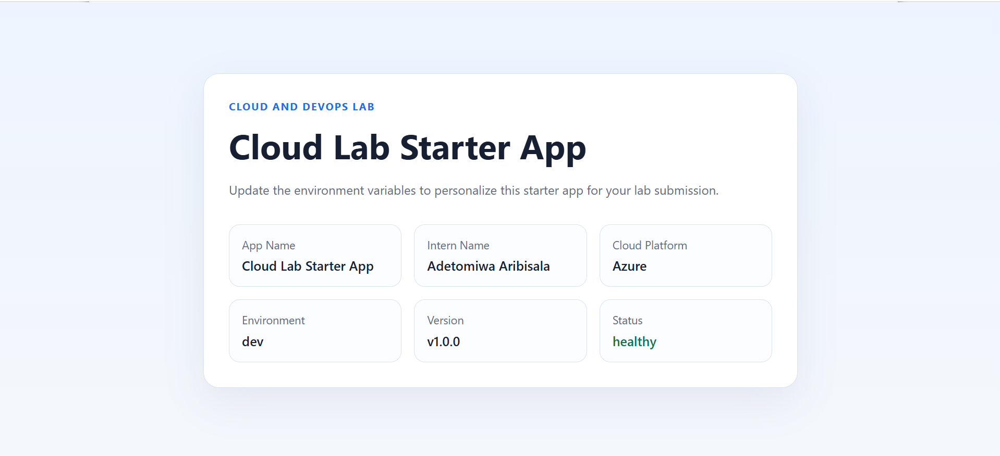
   - Health check: 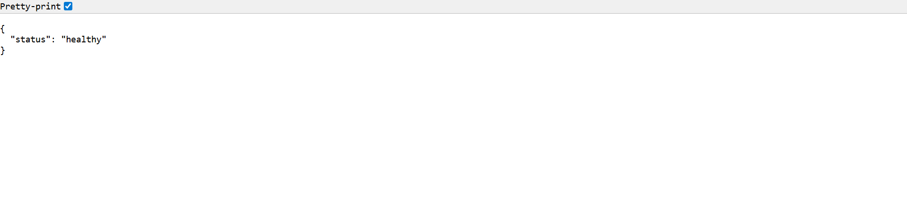

## Run With Docker

1. Build the image:

   ```bash
   docker build -t lab1-starter-app .
   ```
   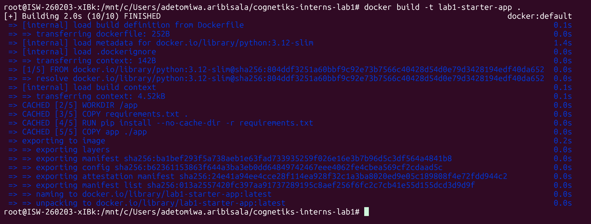

2. Run the container image:

   ```bash
   docker run -d -p 8000:8000 lab1-starter-app:latest
   ```
   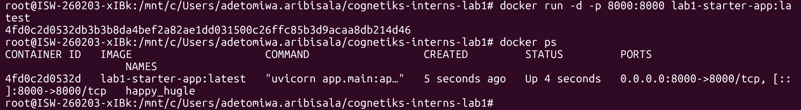

3. Open the app:

   - Homepage: 
   - Health check: 

## Infrastructure As Code (Terraform)

1. Enter Terraform directory:

   ```bash
   cd terraform
   ```

2. Initialize Terraform:

   ```bash
   terraform init
   ```

3. Validate Resources:

   ```bash
   terraform validate
   ```

4. Plan Resources:

   ```bash
   terraform plan
   ```

5. Apply Resources:

   ```bash
   terraform apply
   ```

6. Destroy Resources:

   ```bash
   terraform destroy
   ```

7. Docker Image Tag with Azure Container Registry:

   ```bash
   docker tag lab1-starter-app:latest starterappregistry.azurecr.io/lab1-starter-app:latest
   ```

8. Docker Image Push to Azure Container Registry:

   ```bash
   docker push starterappregistry.azurecr.io/lab1-starter-app:latest
   ```
   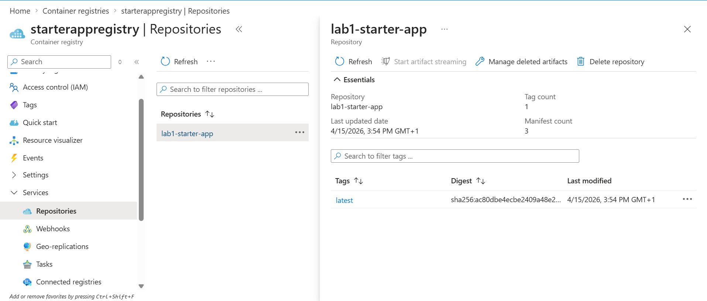

9. Validate created Resources:
   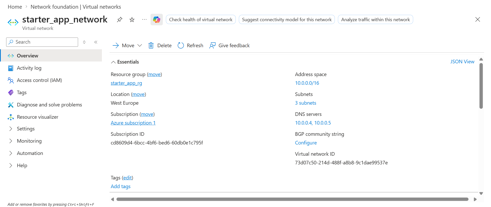
   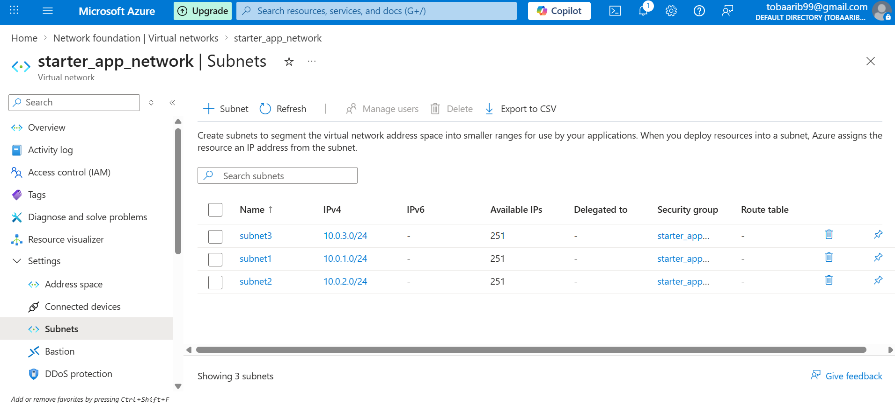
   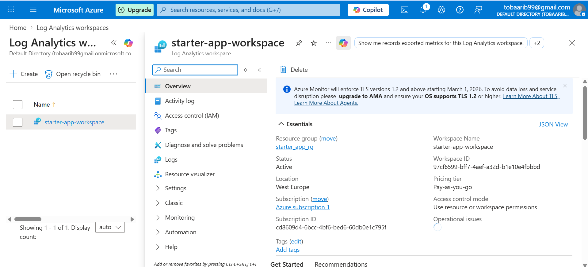

10. Validate Container Apps Environment:
   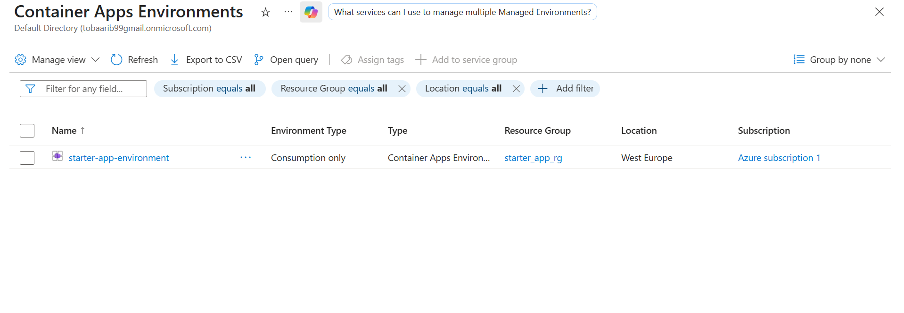

11. Validate Container App, Public URL, Active Revision:
   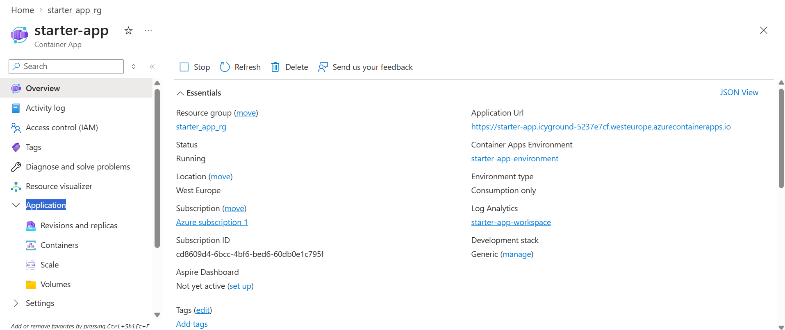
   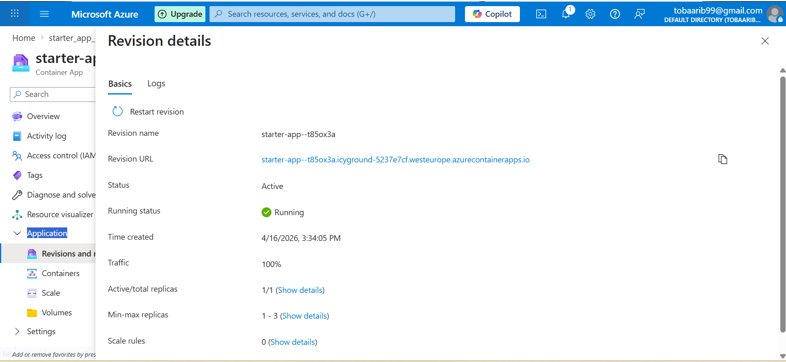

## Live Application URL

- [Application Page URL](https://starter-app.icyground-5237e7cf.westeurope.azurecontainerapps.io)
- [Application Health Page URL](https://starter-app.icyground-5237e7cf.westeurope.azurecontainerapps.io/health)

## Reflection Questions 

- Explain how traffic reaches your container in Azure
- Why must the container port match the ingress configuration?
- What issue did you face and how did you resolve it?
- What would happen if your image could not be pulled from ACR?
- Why are environment variables important in this setup?
- What would you improve for a production deployment?


